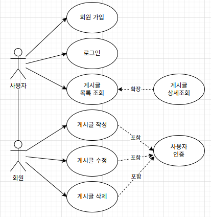
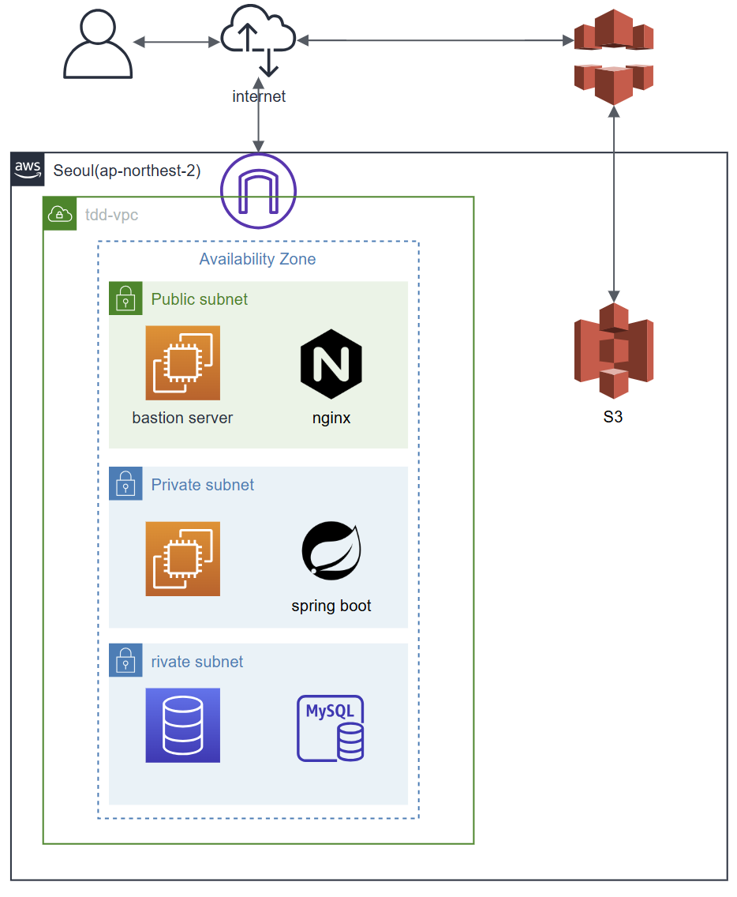

# TDD방법론과 설계공부를 위한 게시판 시스템

TDD 방법론에 대해 공부하고 직접 적용하여 개발해보기 위한 프로젝트입니다. 
TDD 방법론을 공부하며 헥심은 테스트코드를 먼저 작성함으로 인해 객체 지향적이고 테스트하기 편한 "설계"를 하는 것이라고 생각했습니다.
이러한 방법에 헥사고날 아키텍처의 도메인 중심 설계가 적합하다고 느꼈고, **레이어드 아키텍처를 기반으로, 헥사고날 아키텍처의 철학(포트/어댑터 구조와 의존성 역전)을 도입해 관심사 분리와 테스트 용이성을 강화**하도록 설계를 고민하며 작업하였습니다.
- 비즈니스 로직은 게시판API를 구현하며 연습했습니다.
- 외부 라이브러리에 대한 연동 연습은 SpringSecurity를 적용해보며 연습했습니다.
- 이미지 업로드 기능을 위해 실제처럼 aws 배포와 s3 버킷을 적용하며 연습했습니다.

# 유스케이스 다이어그램

# AWS 구조

# API 명세서
[API 명세서](https://www.notion.so/extra-API-22004a70ae3c8031b7b2ec236c0c8187?source=copy_link)

# 패키지구조

  
프로젝트 파일 구조

    <pre>
│  TddTrainApplication.java
│  
├─auth
│  ├─controller
│  │  │  AuthController.java
│  │  │  
│  │  ├─docs
│  │  │      AuthControllerSwagger.java
│  │  │      
│  │  └─dto
│  │          UserLoginDto.java
│  │          
│  ├─domain
│  │      Login.java
│  │      LoginUser.java
│  │
│  ├─infrastructure
│  │  ├─jwt
│  │  │      JwtManagerImpl.java
│  │  │      JwtProperties.java
│  │  │
│  │  └─security
│  │          CurrentUserArgumentResolver.java
│  │          CustomUserDetails.java
│  │          JwtAuthenticationFilter.java
│  │          JwtExtractor.java
│  │          SecurityConfig.java
│  │
│  └─service
│      │  AuthService.java
│      │
│      └─port
│              CurrentUser.java
│              JwtManager.java
│              TokenPayload.java
│
├─common
│  ├─encrypt
│  │  ├─infrastructure
│  │  │      PasswordEncoderImpl.java
│  │  │
│  │  └─service
│  │      └─port
│  │              PasswordEncoder.java
│  │
│  ├─exception
│  │  ├─controller
│  │  │  │  GeneralExceptionAdvice.java
│  │  │  │
│  │  │  └─dto
│  │  │          ErrorFormat.java
│  │  │
│  │  └─domain
│  │          CommonException.java
│  │          ErrorCode.java
│  │
│  ├─logging
│  │      JsonRequestCachingFilter.java
│  │      P6spyConfig.java
│  │      P6spyPrettySqlFormatter.java
│  │
│  ├─swagger
│  │      SwaggerConfig.java
│  │
│  ├─time
│  │  │  SystemDateHolder.java
│  │  │
│  │  └─port
│  │          DateHolder.java
│  │
│  └─util
│      │  StringUtils.java
│      │  SystemUuidHolder.java
│      │
│      └─port
│              UuidHolder.java
│
├─image
│  ├─controller
│  │  │  ImageUploadController.java
│  │  │
│  │  ├─docs
│  │  │      ImageUploadControllerSwagger.java
│  │  │
│  │  └─dto
│  │          ImageUpload.java
│  │
│  ├─domain
│  │      Image.java
│  │      PostImageUpdate.java
│  │
│  ├─infrastructure
│  │  ├─aws
│  │  │      AwsImageManager.java
│  │  │      CloudFrontProperties.java
│  │  │      S3Config.java
│  │  │      S3Properties.java
│  │  │
│  │  └─jpa
│  │          ImageMetaEntity.java
│  │          ImageMetaJpaRepository.java
│  │          ImageMetaRepositoryImpl.java
│  │
│  └─service
│      │  ImageService.java
│      │
│      └─port
│              ImageManager.java
│              ImageMetaRepository.java
│
├─post
│  ├─controller
│  │  │  PostController.java
│  │  │
│  │  ├─docs
│  │  │      PostControllerSwagger.java
│  │  │
│  │  └─dto
│  │          PostChange.java
│  │          PostDetail.java
│  │          PostList.java
│  │          PostSave.java
│  │
│  ├─domain
│  │      Post.java
│  │      PostCreate.java
│  │      PostUpdate.java
│  │
│  ├─infrastructure
│  │  └─jpa
│  │          PostEntity.java
│  │          PostJpaRepository.java
│  │          PostRepositoryImpl.java
│  │
│  └─service
│      │  PostService.java
│      │
│      └─port
│              PostRepository.java
│
└─user
    ├─controller
    │  │  UserController.java
    │  │
    │  ├─docs
    │  │      UserControllerSwagger.java
    │  │
    │  └─dto
    │          SignUp.java
    │
    ├─domain
    │      User.java
    │      UserCreate.java
    │      UserRole.java
    │
    ├─infrastructure
    │  └─jpa
    │          UserEntity.java
    │          UserJpaRepository.java
    │          UserRepositoryImpl.java
    │
    └─service
        │  UserService.java
        │
        └─port
                UserRepository.java
  
  plaintext \`\`\`

  
테스트 파일 구조

  <pre>
  │  TddTrainApplicationTests.java
  │  
  ├─large
  │  └─image
  │      ├─controller
  │      │      ImageUploadControllerTest.java
  │      │      
  │      └─infrastructure
  │          └─aws
  │                  AwsImageManagerTest.java
  │                  
  ├─medium
  │  ├─auth
  │  │  └─controller
  │  │          AuthControllerTest.java
  │  │
  │  ├─post
  │  │  └─controller
  │  │          PostControllerTest.java
  │  │
  │  └─user
  │      └─controller
  │              UserControllerTest.java
  │
  └─small
      ├─auth
      │  ├─infrastructure
      │  │  └─jwt
      │  │          JwtManagerImplTest.java
      │  │
      │  └─service
      │          AuthServiceTest.java
      │
      ├─image
      │  └─service
      │          ImageServiceTest.java
      │
      ├─mock
      │      FakeImageManager.java
      │      FakeImageMetaRepository.java
      │      FakeJwtManager.java
      │      FakePasswordEncoder.java
      │      FakePostRepository.java
      │      FakeUserRepository.java
      │      TestDateHolder.java
      │      TestUuidHolder.java
      │
      ├─post
      │  └─service
      │          PostServiceTest.java
      │
      └─user
          └─service
                  UserServiceTest.java
    </pre>

# 회고
### 아키텍처에 관한 고민
이번 프로젝트에서 가장 많이 고민한 부분은 아키텍처의 방향성이었습니다.
기존의 단순한 레이어드 아키텍처만으로는 테스트 용이성과 비즈니스 로직의 명확성을 보장하기 어렵다고 느꼈습니다.
그래서 헥사고날 아키텍처의 철학을 참고해, 다음과 같은 목표를 세웠습니다.

- 레이어의 역할을 명확히 하고 결합도를 낮춘다.
  → 비즈니스 로직(도메인)이 외부 기술(Spring, JPA, JWT 등)에 종속되지 않도록 한다.
- 포트/어댑터 패턴을 부분적으로 도입해, 서비스 레이어는 인터페이스(port)에 의존하고, 구현체(adapter, infrastructure)는 교체 가능하게 설계한다.
- 테스트 용이성을 확보하기 위해 의존성 역전 원칙을 적용한다.

완벽한 헥사고날을 구현하기보다는, 레이어드 아키텍처 기반에 헥사고날의 철학을 접목해서 실용적인 설계를 시도하려고 노력했습니다. 
보편적으로 사용하는 레이어드아키텍처에 변형이기에 러닝커브가 낮아 나중에 다수와 프로젝트를 진행하여도 쉽게 도입할 수 있을 것이라 기대하고 있습니다.

### 관심사 분리와 책임 분리
특히 Filter와 JWT 관리 로직을 어떻게 나눌지 많이 고민했습니다.
JwtManager는 JWT의 생성/검증/파싱이라는 순수 기술적 책임만 맡도록 하고,
HTTP 요청에서 토큰을 추출하는 부분은 JwtAuthenticateFilter와 같은 web adapter에서 담당하도록 역할을 분리했습니다.

또, 공통적으로 재사용되는 컴포넌트(SystemDateHolder)는 common.time 패키지에,
전역 필터나 예외 처리 핸들러는 common.web.filter, common.exception 등으로 나눠
관심사 별로 위치와 역할을 명확히 하려고 신경 썼습니다.
덕분에 기술적 관심사와 비즈니스 관심사를 잘 구분한 아키텍처가 되었다고 생각합니다.

### 기술적 도전
- JWT 인증/인가를 Spring Security 없이 먼저 구현하고, 이후 Spring Security로 리팩토링하면서 TDD의 장점을 직접 체험해보고자 시도했습니다.
  TDD를 적용하면서 기존에 개발하던 것보다 몇 배의 시간이 소요되었지만, 회귀 테스트를 통해 코드 수정과 리팩토링에 자신감을 얻을 수 있었고,
  결과적으로는 빠르고 안정적으로 개발할 수 있었다는 점을 직접 느껴보며 앞으로의 프로젝트에 TDD방법론을 적극 적용해보고자 다짐했습니다.
- AWS를 활용하여 애플리케이션을 배포하며, 인프라 구성의 기초를 직접 경험하고자 시도했습니다.
  퍼블릭/프라이빗 서브넷을 분리하고, Bastion 서버를 통해 보안을 강화하는 구조를 설계하면서 네트워크 구성의 중요성과 원리를 배우게 되었습니다.
  아직은 단일 서버로 운영하고 있지만, 다음 단계에서는 이중 서버를 구성해 로드밸런서를 적용함으로써 가용성과 확장성을 높여보자는 목표를 세웠습니다.
  이번 경험을 통해 인프라 설계와 운영의 필요성을 몸소 느꼈으며, 앞으로의 프로젝트에도 AWS 기반 아키텍처 설계 경험을 적극적으로 활용해보고자 합니다.

## 작업 내용 공유를 위해 작성한 글
[[작업] SpringSecurity 6.x + JWT 로 RestAPI형식의 로그인 인증 구현하기 ① - 로그인](https://blog.naver.com/khjung1654/223912892653)

[[작업] SpringSecurity 6.x + JWT 로 RestAPI형식의 로그인 인증 구현하기 ② - 인증](https://blog.naver.com/khjung1654/223912940492)
